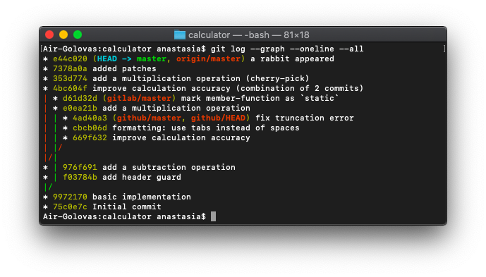

# AK-2 Lab1 
## Виконала: Головаш Анастасія 
## Група: ІВ-82

## Лістинг:
### calculator.cpp
```
#include "calculator.h"

int Calculator::Add (double a, double b)
{
	return a + b + 0.5;
}

int Calculator::Sub (double a, double b)
{
    return Add (a, -b);
}

int Calculator::Mul (double a, double b)
{
    return a * b + 0.5;
}

   	
 /**_** 
_**___** 
_**___**_______ __**** 
_**___**_______ **___**** 
_**__**_______* ___**___** 
__**__*______*_ _**__***__** 
___**__*____*__ **_____**__* 
____**_**__**_* *________** 
____**___**__** 
___*___________ * 
__*____________ _* 
_*____0_____0__ __* 
_*_______@_____ __* 
_*_____________ __* 
___*_____v_____ */
```
### calculator.h
```

#ifndef CALCULATOR_H
#define CALCULATOR_H

class Calculator
{
    public:
        int Add (double, double);
        int Sub (double, double);
        int Mul (double, double);
};

#endif//CALCULATOR_H
```

## Патчі:
### 0001-fix-truncation-error-replacing.patch
```
From 09dcc50ac704b7959a168dd3c5bacf5d4f111306 Mon Sep 17 00:00:00 2001
From: Sergii Piatakov <sergii.piatakov@globallogic.com>
Date: Thu, 15 Nov 2018 15:28:04 +0200
Subject: [PATCH] fix truncation error (replacing)

To convert float to integer the truncation is performed, but the
rounding is expected.

Test: Add (4.9, 4.9) should return 10.
Signed-off-by: Sergii Piatakov <sergii.piatakov@globallogic.com>
---
 calculator.cpp | 2 +-
 1 file changed, 1 insertion(+), 1 deletion(-)

diff --git a/calculator.cpp b/calculator.cpp
index b91afea..d93e35b 100644
--- a/calculator.cpp
+++ b/calculator.cpp
@@ -2,7 +2,7 @@
 
 int Calculator::Add (double a, double b)
 {
-    return a + b;
+	return a + b + 0.5;
 }
 
 int Calculator::Sub (double a, double b)
-- 
2.20.1
```

### 0001-formatting-use-tabs-instead-of-spaces-replacing.patch
```
From 133009b6c2bce038b7a1d605d67caff364885d86 Mon Sep 17 00:00:00 2001
From: Sergii Piatakov <sergii.piatakov@globallogic.com>
Date: Thu, 15 Nov 2018 15:26:35 +0200
Subject: [PATCH] formatting: use tabs instead of spaces (replacing)

Signed-off-by: Sergii Piatakov <sergii.piatakov@globallogic.com>
---
 calculator.cpp | 2 +-
 calculator.h   | 6 +++---
 2 files changed, 4 insertions(+), 4 deletions(-)

diff --git a/calculator.cpp b/calculator.cpp
index d93e35b..d10f529 100644
--- a/calculator.cpp
+++ b/calculator.cpp
@@ -7,5 +7,5 @@ int Calculator::Add (double a, double b)
 
 int Calculator::Sub (double a, double b)
 {
-    return Add (a, -b);
+	return Add (a, -b);
 }
diff --git a/calculator.h b/calculator.h
index 3740907..d59d596 100644
--- a/calculator.h
+++ b/calculator.h
@@ -3,9 +3,9 @@
 
 class Calculator
 {
-    public:
-        int Add (double, double);
-        int Sub (double, double);
+	public:
+		int Add (double, double);
+		int Sub (double, double);
 };
 
 #endif//CALCULATOR_H
-- 
2.20.1
```

## Граф:


## Висновок:
В даній роботі я ознайомилася із системою контролю версій Git та навчилася базовим командам для роботи з цією системою.
